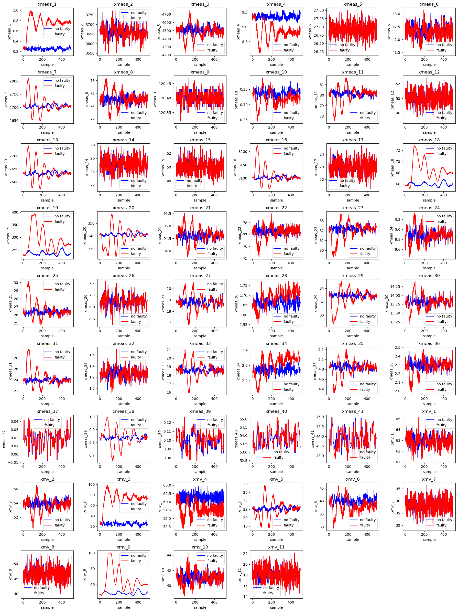
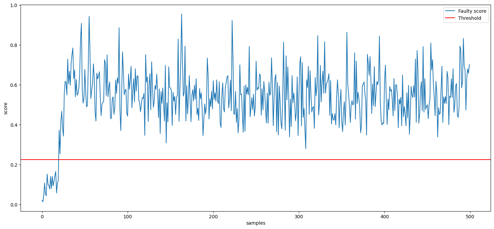

__FAULT DETECTION USING PCA__

This repository contains an exapmle of PCA usaed for fault detection.
Data used for the analyses were taken by the Tennessee Eastman Process datase. this dataset contains 20 different types of failures. For the complete description of the dataset, please refer to the following link:

[The TEP Dataset](https://www.kaggle.com/datasets/averkij/tennessee-eastman-process-simulation-dataset)

In Data Exploration, some visualization and analysis of the data is first done.

We then proceed to use PCA (folder Modelling) to identify the failure. As an example, it was decided to focus only on one type of failure, but the procedure can be applied to all types of failure present in the dataset.

